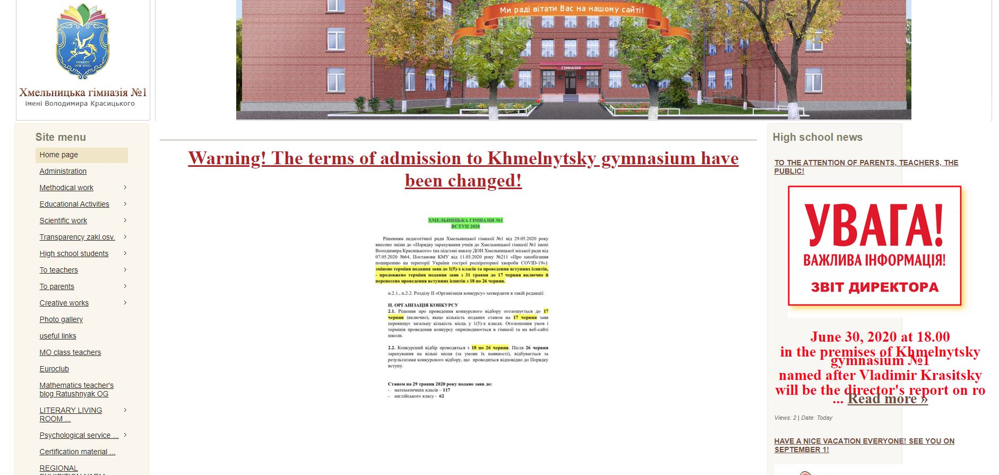
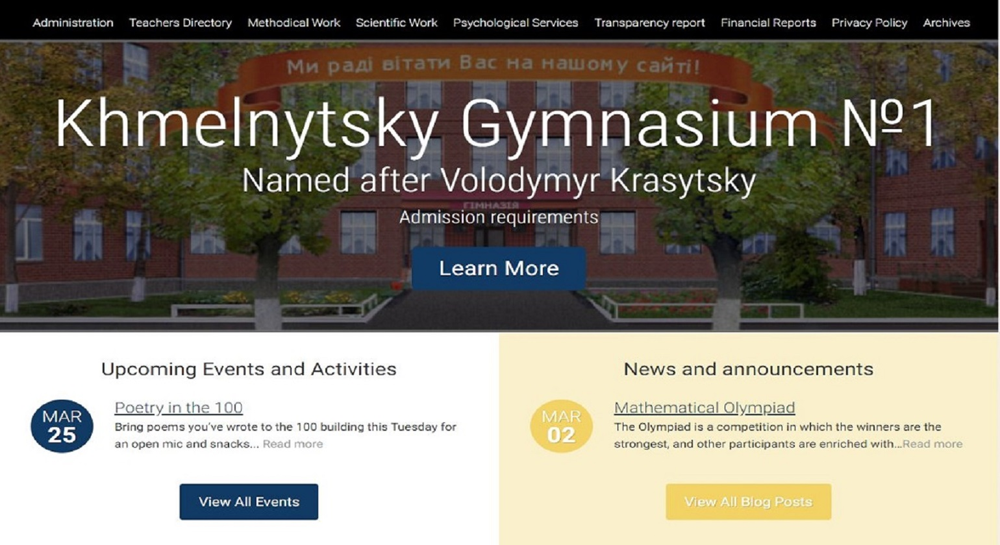

# School-Redesign

### Read case study [Here](http://vitaliybulyma.com/casestudy/) 

The purpose of this project is to completely re-design my high school's website, and introduce CMS(Content Managment System) to site administrators. The school is located in Khmelnitsky, Ukraine, not surprisingly the website is in Ukrainian language. Thankfully, Google Chrome browser can easily translate the website into English. One of the feature I am planning to include will be adding a functionality to translate the web-site into different languages. 

When the project is complete, my intent to give this website as a gift to my school. Since WordPress is available in many languages, I will be able to train site administrators on how to manage the content using their native language. I am very excited to be able to give back to my high school, since I am very grateful for the level of knowledge, they give me. It has grown to be a very prestigious school in the city, however the website does not necessarily represent that.

# Original Layout

# Re-designed Layout

